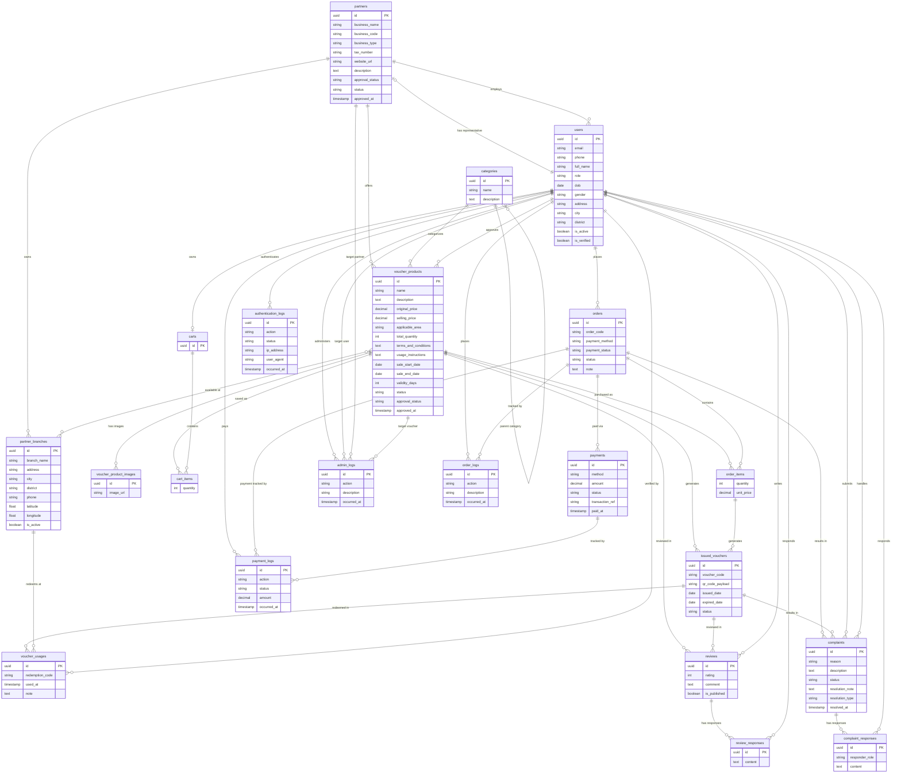

# Voucher Platform – ERD & Data Dictionary

---

## Yêu cầu đồ án

| Mã dữ liệu | Nhóm dữ liệu             | Mô tả                                                                                                                                                                                                       |
| ---------- | ------------------------ | ----------------------------------------------------------------------------------------------------------------------------------------------------------------------------------------------------------- |
| **DR-01**  | **Người dùng**           | Thông tin đăng nhập, hồ sơ cá nhân, vai trò, lịch sử giao dịch và lịch sử hoạt động của người dùng trên hệ thống.                                                                                           |
| **DR-02**  | **Đối tác**              | Thông tin doanh nghiệp, người đại diện, các chi nhánh, trạng thái phê duyệt và trạng thái hoạt động của đối tác cung cấp voucher.                                                                           |
| **DR-03**  | **Voucher sản phẩm**     | Thông tin voucher bao gồm tên voucher, danh mục, giá gốc, giá bán, điều kiện áp dụng, hướng dẫn sử dụng, thời gian mở bán, thời hạn sử dụng, khu vực áp dụng, số lượng phát hành và trạng thái của voucher. |
| **DR-04**  | **Giỏ hàng & đơn hàng**  | Thông tin giỏ hàng, danh sách voucher dự định mua, đơn hàng gồm mã đơn, người mua, danh sách voucher đã mua, tổng tiền, phương thức thanh toán, trạng thái đơn hàng và trạng thái thanh toán.               |
| **DR-05**  | **Voucher phát hành**    | Thông tin voucher điện tử được phát hành sau khi thanh toán thành công, bao gồm mã voucher, đơn hàng liên quan, người sở hữu, trạng thái sử dụng, ngày phát hành, ngày hết hạn và lịch sử sử dụng voucher.  |
| **DR-06**  | **Đánh giá và phản hồi** | Thông tin đánh giá của khách hàng đối với voucher, bao gồm điểm đánh giá, nhận xét, hình ảnh minh chứng (nếu có), khiếu nại và phản hồi xử lý từ đối tác hoặc quản trị viên.                                |

---

## 0. Ghi chú rà soát (Review Notes)

Đối chiếu Data Dictionary với **Yêu cầu đồ án (DR-01 → DR-06)**: đầy đủ nghiệp vụ (users/orders/các bảng log cho DR-01; partners/partner_branches cho DR-02; voucher_products cho DR-03; carts/cart_items/orders/order_items cho DR-04; issued_vouchers/voucher_usages cho DR-05; reviews/review_responses/complaints/complaint_responses cho DR-06).

---

## 1. Conceptual ERD

> Chỉ chứa **thực thể + thuộc tính nghiệp vụ**. Có **khóa chính (PK)** để định danh mỗi thực thể, nhưng **không có khóa ngoại (FK)** và **không có metadata/thuộc tính kỹ thuật** (`created_at`/`updated_at`, url ảnh đại diện, slug, sort*order...), **không có thuộc tính suy diễn** (discount_rate, remaining_quantity, snapped*\*, subtotal...). Quan hệ N:N có thuộc tính được biểu diễn bằng **associative entity** (cart_items,order_items) bo tròn góc khi xuất ảnh và không có `id` riêng.

> Ghi chú nghiệp vụ QR: mỗi `issued_vouchers` có `voucher_code` (mã hiển thị, duy nhất) và `qr_code_payload` (nội dung mã hóa để sinh QR, cũng duy nhất) — đảm bảo mỗi voucher phát hành có **1 mã định danh duy nhất** và **có thể quét bằng QR** khi đổi tại quầy.

---

## 2. Logical ERD

> Bổ sung **khóa chính/khóa ngoại (PK/FK)**, chuyển thực thể sang tên bảng (snake*case, khớp tên bảng ở Physical). **Không** có thuộc tính suy diễn (`discount_rate`, `remaining_quantity`, `snapped*\*`, `subtotal`, `total_amount`, `discount_amount`...) và **không** có metadata thuần túy vận hành (`created_at`, `updated_at`). Các mốc thời gian có ý nghĩa nghiệp vụ vẫn được giữ lại. Bảng trung gian của quan hệ N:N dùng **khóa chính composite từ các FK nối quan hệ**, không dùng `id` riêng.

```mermaid
erDiagram

    users {
        uuid    id          PK
        string  email
        string  phone
        string  full_name
        string  role
        date    dob
        string  gender
        string  address
        string  city
        string  district
        boolean is_active
        boolean is_verified
        uuid      partner_id               FK
        uuid      partner_branches_id      FK
    }

    partners {
        uuid      id                      PK
        uuid      representative_user_id  FK
        string    business_name
        string    business_code
        string    business_type
        string    tax_number
        string    website_url
        text      description
        string    approval_status
        string    status
        uuid      approved_by             FK
        timestamp approved_at
    }

    partner_branches {
        uuid    id          PK
        uuid    partner_id  FK
        string  branch_name
        string  address
        string  city
        string  district
        string  phone
        float   latitude
        float   longitude
        boolean is_active
    }

    categories {
        uuid   id         PK
        uuid   parent_id  FK
        string name
        text   description
    }

    voucher_products {
        uuid      id                   PK
        uuid      partner_id           FK
        uuid      category_id          FK
        string    name
        text      description
        decimal   original_price
        decimal   selling_price
        string    applicable_area
        int       total_quantity
        text      terms_and_conditions
        text      usage_instructions
        date      sale_start_date
        date      sale_end_date
        int       validity_days
        string    status
        string    approval_status
        uuid      approved_by          FK
        timestamp approved_at
    }

    voucher_product_images {
        uuid   id                  PK
        uuid   voucher_product_id  FK
        string image_url
    }

    voucher_product_branches {
        uuid voucher_product_id  PK, FK
        uuid branch_id           PK, FK
    }

    orders {
        uuid   id             PK
        string order_code
        uuid   user_id        FK
        string payment_method
        string payment_status
        string status
        text   note
    }

    carts {
        uuid id       PK
        uuid user_id  FK
    }

    cart_items {
        uuid cart_id             PK, FK
        uuid voucher_product_id  PK, FK
        int  quantity
    }

    order_items {
        uuid    order_id            PK, FK
        uuid    voucher_product_id  PK, FK
        int     quantity
        decimal unit_price
    }

    payments {
        uuid      id              PK
        uuid      order_id        FK
        string    method
        decimal   amount
        string    status
        string    transaction_ref
        timestamp paid_at
    }

    issued_vouchers {
        uuid   id                  PK
        string voucher_code
        string qr_code_payload
        uuid   order_id            FK
        uuid   voucher_product_id  FK
        uuid   owner_id            FK
        date   issued_date
        date   expired_date
        string status
    }

    voucher_usages {
        uuid      id                 PK
        uuid      issued_voucher_id  FK
        uuid      branch_id          FK
        uuid      redeemed_by        FK
        string    redemption_code
        timestamp used_at
        text      note
    }

    reviews {
        uuid    id                  PK
        uuid    voucher_product_id  FK
        uuid    user_id             FK
        uuid    issued_voucher_id   FK
        int     rating
        text    comment
        boolean is_published
    }

    review_responses {
        uuid id            PK
        uuid review_id     FK
        uuid responded_by  FK
        text content
    }

    complaints {
        uuid      id                 PK
        uuid      order_id           FK
        uuid      issued_voucher_id  FK
        uuid      user_id            FK
        string    reason
        text      description
        string    status
        uuid      assigned_to        FK
        text      resolution_note
        string    resolution_type
        timestamp resolved_at
    }

    complaint_responses {
        uuid   id            PK
        uuid   complaint_id  FK
        uuid   responded_by  FK
        string responder_role
        text   content
    }

    authentication_logs {
        uuid      id           PK
        uuid      user_id      FK
        string    action
        string    status
        string    ip_address
        string    user_agent
        timestamp occurred_at
    }

    admin_logs {
        uuid      id                 PK
        uuid      admin_id           FK
        uuid      target_user_id     FK
        uuid      target_partner_id  FK
        uuid      target_voucher_id  FK
        string    action
        text      description
        timestamp occurred_at
    }

    order_logs {
        uuid      id           PK
        uuid      order_id     FK
        uuid      user_id      FK
        string    action
        text      description
        timestamp occurred_at
    }

    payment_logs {
        uuid      id           PK
        uuid      payment_id   FK
        uuid      order_id     FK
        uuid      user_id      FK
        string    action
        string    status
        decimal   amount
        timestamp occurred_at
    }

    %% ══════════════ QUAN HỆ ══════════════
    users                   ||--o{ authentication_logs      : "auth logs"
    users                   ||--o{ admin_logs               : "admin actions"
    users                   ||--o{ admin_logs               : "target user"
    users                   ||--o{ order_logs               : "order logs"
    users                   ||--o{ payment_logs             : "payment logs"

    partners                o|--|| users                    : "represented by"
    partners                ||--o{ users                    : "employs (voucher staff)"
    partner_branches        ||--o{ users                    : "employs (store staff)"
    users                   ||--o{ partners                 : "approves"
    partners                ||--o{ partner_branches          : "has"
    partners                ||--o{ voucher_products          : "lists"
    partners                ||--o{ admin_logs               : "target partner"

    categories              ||--o{ categories                : "parent of"
    categories              ||--o{ voucher_products          : "categorizes"

    voucher_products        ||--o{ voucher_product_images    : "has"
    voucher_products        ||--o{ admin_logs               : "target voucher"
    voucher_products        ||--o{ voucher_product_branches  : "redeemable at"
    partner_branches        ||--o{ voucher_product_branches  : "hosts"
    voucher_products        ||--o{ cart_items                : "saved in"
    voucher_products        ||--o{ order_items                : "ordered via"
    voucher_products        ||--o{ issued_vouchers            : "issues"
    voucher_products        ||--o{ reviews                    : "reviewed via"
    users                   ||--o{ voucher_products          : "approves"

    users                   ||--o| carts                      : "owns"
    carts                   ||--o{ cart_items                 : "contains"
    users                   ||--o{ orders                     : "places"
    orders                  ||--o{ order_items                : "contains"
    orders                  ||--o{ payments                   : "paid via"
    orders                  ||--o{ complaints                 : "may trigger"
    orders                  ||--o{ order_logs                 : "tracked by"
    orders                  ||--o{ payment_logs               : "payment tracked by"

    payments                ||--o{ payment_logs               : "tracked by"

    order_items             ||--o{ issued_vouchers            : "generates"

    issued_vouchers         ||--o{ voucher_usages             : "used via"
    issued_vouchers         ||--o{ reviews                    : "tied to"
    issued_vouchers         ||--o{ complaints                 : "may trigger"

    partner_branches        ||--o{ voucher_usages             : "redeemed at"
    users                   ||--o{ voucher_usages             : "confirmed by"

    users                   ||--o{ reviews                    : "writes"
    reviews                 ||--o{ review_responses           : "replied by"
    users                   ||--o{ review_responses           : "responds"

    users                   ||--o{ complaints                 : "files"
    users                   ||--o{ complaints                 : "handles"
    complaints              ||--o{ complaint_responses        : "replied by"
    users                   ||--o{ complaint_responses        : "responds"
```

---

## 3. Physical ERD

```mermaid
erDiagram

    %% ══════════════════════════════════════════
    %% DR-01 · NGƯỜI DÙNG
    %% ══════════════════════════════════════════

    users {
        uuid      id              PK
        string    email
        string    phone
        string    password_hash
        string    full_name
        string    avatar_url
        string    role
        date      dob
        string    gender
        string    address
        string    city
        string    district
        boolean   is_active
        boolean   is_verified
        uuid      partner_id               FK
        uuid      partner_branches_id      FK
        timestamp created_at
        timestamp updated_at
    }

    refresh_tokens {
        uuid      id          PK
        uuid      user_id     FK
        string    token_hash
        timestamp expires_at
        timestamp revoked_at
        timestamp created_at
    }


    authentication_logs {
        uuid      id          PK
        uuid      user_id     FK
        string    action
        string    status
        string    ip_address
        string    user_agent
        timestamp occurred_at
    }

    admin_logs {
        uuid      id                 PK
        uuid      admin_id           FK
        uuid      target_user_id     FK
        uuid      target_partner_id  FK
        uuid      target_voucher_id  FK
        string    action
        text      description
        timestamp occurred_at
    }

    order_logs {
        uuid      id          PK
        uuid      order_id    FK
        uuid      user_id     FK
        string    action
        text      description
        timestamp occurred_at
    }

    payment_logs {
        uuid      id          PK
        uuid      payment_id  FK
        uuid      order_id    FK
        uuid      user_id     FK
        string    action
        string    status
        decimal   amount
        timestamp occurred_at
    }

    %% ══════════════════════════════════════════
    %% DR-02 · ĐỐI TÁC
    %% ══════════════════════════════════════════

    partners {
        uuid      id                   PK
        uuid      representative_user_id        FK
        string    business_name
        string    business_code
        string    business_type
        string    tax_number
        string    logo_url
        string    website_url
        string    description
        string    approval_status
        string    status
        uuid      approved_by          FK
        timestamp approved_at
        timestamp created_at
        timestamp updated_at
    }

    partner_branches {
        uuid      id              PK
        uuid      partner_id      FK
        string    branch_name
        string    address
        string    city
        string    district
        string    phone
        float     latitude
        float     longitude
        boolean   is_active
        timestamp created_at
    }

    %% ══════════════════════════════════════════
    %% DR-03 · VOUCHER SẢN PHẨM (listing)
    %% ══════════════════════════════════════════

    categories {
        uuid   id          PK
        uuid   parent_id   FK
        string name
        string slug
        string description
        int    sort_order
    }

    voucher_products {
        uuid      id                  PK
        uuid      partner_id          FK
        uuid      category_id         FK
        string    name
        text      description
        string    thumbnail_url
        decimal   original_price
        decimal   selling_price
        float     discount_rate
        string    applicable_area
        int       total_quantity
        int       remaining_quantity
        jsonb     terms_and_conditions
        jsonb     usage_instructions
        date      sale_start_date
        date      sale_end_date
        int       validity_days
        string    status
        string    approval_status
        uuid      approved_by         FK
        timestamp approved_at
        timestamp created_at
        timestamp updated_at
    }

    voucher_product_images {
        uuid    id                  PK
        uuid    voucher_product_id  FK
        string  image_url
        boolean is_primary
        int     sort_order
    }

    voucher_product_branches {
        uuid    id                  PK
        uuid    voucher_product_id  FK
        uuid    branch_id           FK
    }
    %% Gợi ý ràng buộc: UNIQUE (voucher_product_id, branch_id) để mỗi chi nhánh chỉ xuất hiện một lần cho cùng một voucher.

    %% ══════════════════════════════════════════
    %% DR-04 · GIỎ HÀNG & ĐƠN HÀNG
    %% ══════════════════════════════════════════

    orders {
        uuid      id                  PK
        string    order_code
        uuid      user_id             FK
        decimal   subtotal
        decimal   discount_amount
        decimal   total_amount
        string    payment_method
        string    payment_status
        string    status
        string    note
        timestamp created_at
        timestamp updated_at
    }

    carts {
        uuid      id          PK
        uuid      user_id     FK
        timestamp created_at
        timestamp updated_at
    }

    cart_items {
        uuid      id                  PK
        uuid      cart_id             FK
        uuid      voucher_product_id  FK
        int       quantity
        timestamp created_at
        timestamp updated_at
    }

    order_items {
        uuid      id                      PK
        uuid      order_id                FK
        uuid      voucher_product_id      FK
        int       quantity
        decimal   unit_price
        decimal   snapped_original_price
        decimal   snapped_selling_price
        float     snapped_discount_rate
        decimal   subtotal
        timestamp created_at
    }
    %% Gợi ý ràng buộc: UNIQUE (order_id, voucher_product_id) để mỗi voucher product chỉ xuất hiện một dòng trong cùng một đơn hàng.

    payments {
        uuid      id              PK
        uuid      order_id        FK
        string    method
        decimal   amount
        string    status
        string    transaction_ref
        string    gateway_response
        timestamp paid_at
        timestamp created_at
    }

    %% ══════════════════════════════════════════
    %% DR-05 · VOUCHER PHÁT HÀNH (electronic)
    %% ══════════════════════════════════════════

    issued_vouchers {
        uuid      id                  PK
        string    voucher_code
        string    qr_code_payload
        string    qr_code_image_url
        uuid      order_item_id       FK
        uuid      voucher_product_id  FK
        uuid      owner_id            FK
        date      issued_date
        date      expired_date
        string    status
        timestamp created_at
        timestamp updated_at
    }

    voucher_usages {
        uuid      id                  PK
        uuid      issued_voucher_id   FK
        uuid      branch_id           FK
        uuid      redeemed_by         FK
        string    redemption_code
        timestamp used_at
        string    note
    }

    %% ══════════════════════════════════════════
    %% DR-06 · ĐÁNH GIÁ & PHẢN HỒI
    %% ══════════════════════════════════════════

    reviews {
        uuid      id                  PK
        uuid      voucher_product_id  FK
        uuid      user_id             FK
        uuid      issued_voucher_id   FK
        int       rating
        text      comment
        jsonb     media_urls
        boolean   is_published
        timestamp created_at
        timestamp updated_at
    }

    review_responses {
        uuid      id              PK
        uuid      review_id       FK
        uuid      responded_by    FK
        text      content
        timestamp created_at
    }

    complaints {
        uuid      id                  PK
        uuid      order_id            FK
        uuid      issued_voucher_id   FK
        uuid      user_id             FK
        string    reason
        text      description
        jsonb     evidence_urls
        string    status
        uuid      assigned_to         FK
        text      resolution_note
        string    resolution_type
        timestamp created_at
        timestamp resolved_at
    }

    complaint_responses {
        uuid      id              PK
        uuid      complaint_id    FK
        uuid      responded_by    FK
        string    responder_role
        text      content
        timestamp created_at
    }

    %% ══════════════════════════════════════════
    %% RELATIONSHIPS
    %% ══════════════════════════════════════════

    users                   ||--o{ authentication_logs : "auth logs"
    users                   ||--o{ refresh_tokens      : "sessions"
    users                   ||--o{ admin_logs          : "admin actions"
    users                   ||--o{ admin_logs          : "target user"
    users                   ||--o{ order_logs          : "order logs"
    users                   ||--o{ payment_logs        : "payment logs"

    partners                o|--|| users    : "represented by"
    partners                ||--o{ partner_branches           : "has"
    partners                ||--o{ users           : "employs (voucher staff)"
    partner_branches        ||--o{ users                     : "employs (store staff)"
    partners                ||--o{ voucher_products           : "lists"
    partners                ||--o{ admin_logs                  : "target partner"

    categories              ||--o{ categories                 : "parent of"
    categories              ||--o{ voucher_products           : "categorizes"

    voucher_products        ||--o{ voucher_product_images     : "has"
    voucher_products        ||--o{ admin_logs                  : "target voucher"
    voucher_products        ||--o{ voucher_product_branches   : "redeemable at"
    partner_branches        ||--o{ voucher_product_branches   : "hosts"
    voucher_products        ||--o{ cart_items                 : "saved in"
    voucher_products        ||--o{ order_items                : "ordered via"
    voucher_products        ||--o{ issued_vouchers            : "issues"
    voucher_products        ||--o{ reviews                    : "reviewed via"

    users                   ||--o| carts                      : "owns"
    carts                   ||--o{ cart_items                 : "contains"
    users                   ||--o{ orders                     : "places"
    orders                  ||--o{ order_items                : "contains"
    orders                  ||--o{ payments                   : "paid via"
    orders                  ||--o{ complaints                 : "may trigger"
    orders                  ||--o{ order_logs                 : "tracked by"
    orders                  ||--o{ payment_logs               : "payment tracked by"

    payments                ||--o{ payment_logs               : "tracked by"

    order_items             ||--o{ issued_vouchers            : "generates"

    issued_vouchers         ||--o{ voucher_usages             : "used via"
    issued_vouchers         ||--o{ reviews                    : "tied to"
    issued_vouchers         ||--o{ complaints                 : "may trigger"

    partner_branches        ||--o{ voucher_usages             : "redeemed at"
    users        ||--o{ voucher_usages             : "confirmed by"

    reviews                 ||--o{ review_responses           : "replied by"
    complaints              ||--o{ complaint_responses        : "replied by"
```

---

## 4. Data Dictionary

### DR-01 · users

| Column                | Type         | Constraint      | Mô tả                                                 |
| --------------------- | ------------ | --------------- | ----------------------------------------------------- |
| `id`                  | UUID         | PK              | Định danh người dùng                                  |
| `email`               | VARCHAR(255) | UNIQUE NOT NULL | Email đăng nhập                                       |
| `phone`               | VARCHAR(20)  | UNIQUE          | Số điện thoại                                         |
| `password_hash`       | VARCHAR(255) | NOT NULL        | Mật khẩu đã hash (bcrypt)                             |
| `full_name`           | VARCHAR(100) | NOT NULL        | Họ tên đầy đủ                                         |
| `avatar_url`          | TEXT         |                 | URL ảnh đại diện                                      |
| `role`                | ENUM         | NOT NULL        | `buyer` · `partner_owner` · `partner_voucher_staff` · `partner_store_staff` · `admin_content` · `admin_operations` · `admin_security` |
| `dob`                 | DATE         |                 | Ngày sinh                                             |
| `gender`              | ENUM         |                 | `male` · `female` · `other`                           |
| `address`             | TEXT         |                 | Địa chỉ chi tiết                                      |
| `city`                | VARCHAR(100) |                 | Tỉnh/thành phố                                        |
| `district`            | VARCHAR(100) |                 | Quận/huyện                                            |
| `is_active`           | BOOLEAN      | DEFAULT true    | Trạng thái tài khoản                                  |
| `is_verified`         | BOOLEAN      | DEFAULT false   | Đã xác thực email/phone                               |
| `partner_id`          | UUID         | FK NULLABLE     | Đối tác trực thuộc, dùng cho `partner_owner` và `partner_voucher_staff` (không thuộc 1 chi nhánh cụ thể) |
| `partner_branches_id` | UUID         | FK NULLABLE     | Chi nhánh làm việc, dùng cho `partner_store_staff`    |
| `created_at`          | TIMESTAMP    | NOT NULL        | Thời điểm tạo                                         |
| `updated_at`          | TIMESTAMP    | NOT NULL        | Thời điểm cập nhật                                    |

### DR-01 · authentication_logs

| Column        | Type         | Constraint | Mô tả                                                               |
| ------------- | ------------ | ---------- | ------------------------------------------------------------------- |
| `id`          | UUID         | PK         |                                                                     |
| `user_id`     | UUID         | FK         | Tham chiếu `users.id`; có thể null với đăng nhập thất bại chưa rõ user |
| `action`      | VARCHAR(100) | NOT NULL   | `LOGIN` · `LOGIN_FAILED` · `LOGOUT` · `CHANGE_PASSWORD` · `RESET_PASSWORD` |
| `status`      | VARCHAR(50)  | NOT NULL   | Trạng thái kết quả xác thực                                         |
| `ip_address`  | VARCHAR(45)  |            | IPv4/IPv6                                                           |
| `user_agent`  | TEXT         |            | Trình duyệt/thiết bị                                                |
| `occurred_at` | TIMESTAMP    | NOT NULL   | Thời điểm xảy ra                                                    |

### DR-01 · admin_logs

| Column              | Type         | Constraint  | Mô tả                                                        |
| ------------------- | ------------ | ----------- | ------------------------------------------------------------ |
| `id`                | UUID         | PK          |                                                              |
| `admin_id`          | UUID         | FK NOT NULL | Tham chiếu `users.id` của admin thực hiện thao tác           |
| `target_user_id`    | UUID         | FK NULLABLE | User bị tác động, ví dụ khóa tài khoản hoặc đổi role         |
| `target_partner_id` | UUID         | FK NULLABLE | Partner bị tác động, ví dụ duyệt/từ chối đối tác             |
| `target_voucher_id` | UUID         | FK NULLABLE | Voucher bị tác động, ví dụ duyệt/từ chối voucher             |
| `action`            | VARCHAR(100) | NOT NULL    | `APPROVE_PARTNER` · `REJECT_PARTNER` · `APPROVE_VOUCHER` · `REJECT_VOUCHER` · `LOCK_ACCOUNT` · `CHANGE_ROLE` |
| `description`       | TEXT         |             | Mô tả chi tiết thao tác quản trị                             |
| `occurred_at`       | TIMESTAMP    | NOT NULL    | Thời điểm xảy ra                                             |

Ràng buộc nghiệp vụ: mỗi bản ghi `admin_logs` chỉ có một trong ba cột `target_user_id`, `target_partner_id`, `target_voucher_id` khác NULL.

### DR-01 · order_logs

| Column        | Type         | Constraint  | Mô tả                                             |
| ------------- | ------------ | ----------- | ------------------------------------------------- |
| `id`          | UUID         | PK          |                                                   |
| `order_id`    | UUID         | FK NOT NULL | Tham chiếu `orders.id`                            |
| `user_id`     | UUID         | FK NOT NULL | Tham chiếu `users.id`                             |
| `action`      | VARCHAR(100) | NOT NULL    | `CREATE_ORDER` · `CANCEL_ORDER` · `UPDATE_STATUS` |
| `description` | TEXT         |             | Mô tả chi tiết thay đổi vòng đời đơn hàng         |
| `occurred_at` | TIMESTAMP    | NOT NULL    | Thời điểm xảy ra                                  |

### DR-01 · payment_logs

| Column             | Type         | Constraint  | Mô tả                                             |
| ------------------ | ------------ | ----------- | ------------------------------------------------- |
| `id`               | UUID         | PK          |                                                   |
| `payment_id`       | UUID         | FK NOT NULL | Tham chiếu `payments.id`                          |
| `order_id`         | UUID         | FK NOT NULL | Tham chiếu `orders.id`                            |
| `user_id`          | UUID         | FK NOT NULL | Tham chiếu `users.id`                             |
| `action`           | VARCHAR(100) | NOT NULL    | `PAYMENT_CREATED` · `PAYMENT_SUCCESS` · `PAYMENT_FAILED` · `REFUND` |
| `status`           | VARCHAR(50)  | NOT NULL    | Trạng thái thanh toán tại thời điểm ghi log       |
| `amount`           | DECIMAL(15,0) | NOT NULL   | Số tiền giao dịch tại thời điểm ghi log           |
| `occurred_at`      | TIMESTAMP    | NOT NULL    | Thời điểm xảy ra                                  |

---

### DR-02 · partners

| Column                   | Type         | Constraint      | Mô tả                                                                 |
| ------------------------ | ------------ | --------------- | --------------------------------------------------------------------- |
| `id`                     | UUID         | PK              |                                                                       |
| `representative_user_id` | UUID         | FK NOT NULL     | Tham chiếu `users.id` — người đại diện pháp lý của đối tác            |
| `business_name`          | VARCHAR(255) | NOT NULL        | Tên doanh nghiệp                                                      |
| `business_code`          | VARCHAR(50)  | UNIQUE NOT NULL | Mã số doanh nghiệp                                                    |
| `business_type`          | VARCHAR(100) |                 | Loại hình: `restaurant` · `spa` · `entertainment` · `hotel` · `other` |
| `tax_number`             | VARCHAR(20)  | UNIQUE          | Mã số thuế                                                            |
| `logo_url`               | TEXT         |                 | URL logo                                                              |
| `website_url`            | TEXT         |                 | Website đối tác                                                       |
| `description`            | TEXT         |                 | Mô tả đối tác                                                         |
| `approval_status`        | ENUM         | NOT NULL        | `pending` · `approved` · `rejected`                                   |
| `status`                 | ENUM         | NOT NULL        | `active` · `suspended` · `closed`                                     |
| `approved_by`            | UUID         | FK              | Tham chiếu `users.id` (admin)                                         |
| `approved_at`            | TIMESTAMP    |                 |                                                                       |
| `created_at`             | TIMESTAMP    | NOT NULL        |                                                                       |
| `updated_at`             | TIMESTAMP    | NOT NULL        |                                                                       |

### DR-02 · partner_branches

| Column        | Type         | Constraint   | Mô tả                    |
| ------------- | ------------ | ------------ | ------------------------ |
| `id`          | UUID         | PK           |                          |
| `partner_id`  | UUID         | FK NOT NULL  | Tham chiếu `partners.id` |
| `branch_name` | VARCHAR(255) | NOT NULL     | Tên chi nhánh            |
| `address`     | TEXT         | NOT NULL     | Địa chỉ chi tiết         |
| `city`        | VARCHAR(100) | NOT NULL     | Tỉnh/thành phố           |
| `district`    | VARCHAR(100) |              | Quận/huyện               |
| `phone`       | VARCHAR(20)  |              | SĐT chi nhánh            |
| `latitude`    | FLOAT        |              | Vĩ độ (bản đồ)           |
| `longitude`   | FLOAT        |              | Kinh độ (bản đồ)         |
| `is_active`   | BOOLEAN      | DEFAULT true | Trạng thái hoạt động     |
| `created_at`  | TIMESTAMP    | NOT NULL     |                          |

---

### DR-03 · categories

| Column        | Type         | Constraint      | Mô tả                        |
| ------------- | ------------ | --------------- | ---------------------------- |
| `id`          | UUID         | PK              |                              |
| `parent_id`   | UUID         | FK NULLABLE     | Danh mục cha (tự tham chiếu) |
| `name`        | VARCHAR(100) | NOT NULL        | Tên danh mục                 |
| `slug`        | VARCHAR(100) | UNIQUE NOT NULL | URL-friendly name            |
| `description` | TEXT         |                 | Mô tả                        |
| `sort_order`  | INT          | DEFAULT 0       | Thứ tự hiển thị              |

### DR-03 · voucher_products

| Column                 | Type          | Constraint  | Mô tả                                                                |
| ---------------------- | ------------- | ----------- | -------------------------------------------------------------------- |
| `id`                   | UUID          | PK          |                                                                      |
| `partner_id`           | UUID          | FK NOT NULL | Tham chiếu `partners.id`                                             |
| `category_id`          | UUID          | FK NOT NULL | Tham chiếu `categories.id`                                           |
| `name`                 | VARCHAR(255)  | NOT NULL    | Tên voucher                                                          |
| `description`          | TEXT          |             | Mô tả chi tiết                                                       |
| `thumbnail_url`        | TEXT          |             | Ảnh đại diện                                                         |
| `original_price`       | DECIMAL(15,0) | NOT NULL    | Giá gốc (VNĐ)                                                        |
| `selling_price`        | DECIMAL(15,0) | NOT NULL    | Giá bán trên nền tảng                                                |
| `discount_rate`        | FLOAT         |             | Phần trăm giảm giá _(suy diễn từ `original_price`, `selling_price`)_ |
| `applicable_area`      | VARCHAR(255)  |             | Khu vực áp dụng                                                      |
| `total_quantity`       | INT           | NOT NULL    | Tổng số lượng phát hành                                              |
| `remaining_quantity`   | INT           | NOT NULL    | Số lượng còn lại _(suy diễn: total − đã bán)_                        |
| `terms_and_conditions` | JSONB         |             | Điều kiện áp dụng                                                    |
| `usage_instructions`   | JSONB         |             | Hướng dẫn sử dụng                                                    |
| `sale_start_date`      | DATE          | NOT NULL    | Ngày bắt đầu bán                                                     |
| `sale_end_date`        | DATE          | NOT NULL    | Ngày kết thúc bán                                                    |
| `validity_days`        | INT           | NOT NULL    | Số ngày hiệu lực sau khi mua                                         |
| `status`               | ENUM          | NOT NULL    | `draft` · `active` · `paused` · `sold_out` · `expired`               |
| `approval_status`      | ENUM          | NOT NULL    | `pending` · `approved` · `rejected`                                  |
| `approved_by`          | UUID          | FK          | Tham chiếu `users.id` (admin)                                        |
| `approved_at`          | TIMESTAMP     |             |                                                                      |
| `created_at`           | TIMESTAMP     | NOT NULL    |                                                                      |
| `updated_at`           | TIMESTAMP     | NOT NULL    |                                                                      |

### DR-03 · voucher_product_images

| Column               | Type    | Constraint    | Mô tả                            |
| -------------------- | ------- | ------------- | -------------------------------- |
| `id`                 | UUID    | PK            |                                  |
| `voucher_product_id` | UUID    | FK NOT NULL   | Tham chiếu `voucher_products.id` |
| `image_url`          | TEXT    | NOT NULL      | URL hình ảnh                     |
| `is_primary`         | BOOLEAN | DEFAULT false | Ảnh chính                        |
| `sort_order`         | INT     | DEFAULT 0     | Thứ tự hiển thị                  |

### DR-03 · voucher_product_branches

| Column               | Type | Constraint  | Mô tả                            |
| -------------------- | ---- | ----------- | -------------------------------- |
| `id`                 | UUID | PK          |                                  |
| `voucher_product_id` | UUID | FK NOT NULL | Tham chiếu `voucher_products.id` |
| `branch_id`          | UUID | FK NOT NULL | Chi nhánh có thể đổi voucher     |

Gợi ý ràng buộc: UNIQUE (`voucher_product_id`, `branch_id`) để mỗi chi nhánh chỉ xuất hiện một lần cho cùng một voucher.

---

### DR-04 · carts

| Column       | Type      | Constraint         | Mô tả                                                         |
| ------------ | --------- | ------------------ | ------------------------------------------------------------- |
| `id`         | UUID      | PK                 | Định danh giỏ hàng                                            |
| `user_id`    | UUID      | FK UNIQUE NOT NULL | Tham chiếu `users.id`; mỗi buyer có một giỏ hàng hiện hành    |
| `created_at` | TIMESTAMP | NOT NULL           | Thời điểm tạo                                                 |
| `updated_at` | TIMESTAMP | NOT NULL           | Thời điểm cập nhật                                            |

### DR-04 · cart_items

| Column               | Type      | Constraint  | Mô tả                                            |
| -------------------- | --------- | ----------- | ------------------------------------------------ |
| `id`                 | UUID      | PK          |                                                  |
| `cart_id`            | UUID      | FK NOT NULL | Tham chiếu `carts.id`                            |
| `voucher_product_id` | UUID      | FK NOT NULL | Tham chiếu `voucher_products.id`                 |
| `quantity`           | INT       | NOT NULL    | Số lượng voucher dự định mua                     |
| `created_at`         | TIMESTAMP | NOT NULL    | Thời điểm thêm vào giỏ                           |
| `updated_at`         | TIMESTAMP | NOT NULL    | Thời điểm cập nhật số lượng                      |

Gợi ý ràng buộc: UNIQUE (`cart_id`, `voucher_product_id`) để mỗi voucher product chỉ xuất hiện một dòng trong cùng một giỏ hàng.

### DR-04 · orders

| Column            | Type          | Constraint      | Mô tả                                                    |
| ----------------- | ------------- | --------------- | -------------------------------------------------------- |
| `id`              | UUID          | PK              |                                                          |
| `order_code`      | VARCHAR(30)   | UNIQUE NOT NULL | Mã đơn hàng hiển thị                                     |
| `user_id`         | UUID          | FK NOT NULL     | Tham chiếu `users.id`                                    |
| `subtotal`        | DECIMAL(15,0) | NOT NULL        | Tổng trước giảm giá _(suy diễn: Σ order_items.subtotal)_ |
| `discount_amount` | DECIMAL(15,0) | DEFAULT 0       | Số tiền được giảm                                        |
| `total_amount`    | DECIMAL(15,0) | NOT NULL        | Tổng thanh toán _(suy diễn: subtotal − discount_amount)_ |
| `payment_method`  | ENUM          | NOT NULL        | `momo` · `vnpay` · `zalopay` · `bank_transfer`           |
| `payment_status`  | ENUM          | NOT NULL        | `pending` · `paid` · `failed` · `refunded`               |
| `status`          | ENUM          | NOT NULL        | `pending` · `confirmed` · `completed` · `cancelled`      |
| `note`            | TEXT          |                 | Ghi chú của người mua                                    |
| `created_at`      | TIMESTAMP     | NOT NULL        |                                                          |
| `updated_at`      | TIMESTAMP     | NOT NULL        |                                                          |

### DR-04 · order_items

| Column                   | Type          | Constraint  | Mô tả                                                      |
| ------------------------ | ------------- | ----------- | ---------------------------------------------------------- |
| `id`                     | UUID          | PK          |                                                            |
| `order_id`               | UUID          | FK NOT NULL | Tham chiếu `orders.id`                                     |
| `voucher_product_id`     | UUID          | FK NOT NULL | Tham chiếu `voucher_products.id`                           |
| `quantity`               | INT           | NOT NULL    | Số lượng mua                                               |
| `unit_price`             | DECIMAL(15,0) | NOT NULL    | Giá tại thời điểm mua                                      |
| `snapped_original_price` | DECIMAL(15,0) | NOT NULL    | Snapshot giá gốc _(suy diễn — chụp lại tại thời điểm mua)_ |
| `snapped_selling_price`  | DECIMAL(15,0) | NOT NULL    | Snapshot giá bán _(suy diễn)_                              |
| `snapped_discount_rate`  | FLOAT         | NOT NULL    | Snapshot % giảm giá _(suy diễn)_                           |
| `subtotal`               | DECIMAL(15,0) | NOT NULL    | _(suy diễn: `unit_price × quantity`)_                      |
| `created_at`             | TIMESTAMP     | NOT NULL    |                                                            |

Gợi ý ràng buộc: UNIQUE (`order_id`, `voucher_product_id`) để mỗi voucher product chỉ xuất hiện một dòng trong cùng một đơn hàng.

### DR-04 · payments

| Column             | Type          | Constraint  | Mô tả                                          |
| ------------------ | ------------- | ----------- | ---------------------------------------------- |
| `id`               | UUID          | PK          |                                                |
| `order_id`         | UUID          | FK NOT NULL | Tham chiếu `orders.id`                         |
| `method`           | ENUM          | NOT NULL    | `momo` · `vnpay` · `zalopay` · `bank_transfer` |
| `amount`           | DECIMAL(15,0) | NOT NULL    | Số tiền giao dịch                              |
| `status`           | ENUM          | NOT NULL    | `pending` · `success` · `failed` · `refunded`  |
| `transaction_ref`  | VARCHAR(255)  |             | Mã giao dịch từ cổng thanh toán                |
| `gateway_response` | TEXT          |             | Raw response từ gateway                        |
| `paid_at`          | TIMESTAMP     |             | Thời điểm thanh toán thành công                |
| `created_at`       | TIMESTAMP     | NOT NULL    |                                                |

---

### DR-05 · issued_vouchers

| Column               | Type         | Constraint      | Mô tả                                                                                                              |
| -------------------- | ------------ | --------------- | ------------------------------------------------------------------------------------------------------------------ |
| `id`                 | UUID         | PK              |                                                                                                                    |
| `voucher_code`       | VARCHAR(50)  | UNIQUE NOT NULL | Mã voucher điện tử (hiển thị cho user — mỗi voucher phát hành là **duy nhất**)                                     |
| `qr_code_payload`    | VARCHAR(255) | UNIQUE NOT NULL | _(bổ sung)_ Chuỗi dữ liệu mã hóa dùng để sinh QR, đảm bảo mỗi voucher có 1 mã QR duy nhất để quét xác thực khi đổi |
| `qr_code_image_url`  | TEXT         |                 | _(bổ sung)_ URL ảnh QR đã render từ `qr_code_payload` để hiển thị/quét — thuộc tính kỹ thuật (chỉ có ở Physical)   |
| `order_item_id`      | UUID         | FK NOT NULL     | Tham chiếu `order_items.id`                                                                                        |
| `voucher_product_id` | UUID         | FK NOT NULL     | Tham chiếu `voucher_products.id`                                                                                   |
| `owner_id`           | UUID         | FK NOT NULL     | Tham chiếu `users.id`                                                                                              |
| `issued_date`        | DATE         | NOT NULL        | Ngày phát hành                                                                                                     |
| `expired_date`       | DATE         | NOT NULL        | Ngày hết hạn (`issued_date + validity_days`)                                                                       |
| `status`             | ENUM         | NOT NULL        | `active` · `used` · `expired` · `refunded`                                                                         |
| `created_at`         | TIMESTAMP    | NOT NULL        |                                                                                                                    |
| `updated_at`         | TIMESTAMP    | NOT NULL        |                                                                                                                    |

### DR-05 · voucher_usages

| Column              | Type        | Constraint  | Mô tả                                                           |
| ------------------- | ----------- | ----------- | --------------------------------------------------------------- |
| `id`                | UUID        | PK          |                                                                 |
| `issued_voucher_id` | UUID        | FK NOT NULL | Tham chiếu `issued_vouchers.id`                                 |
| `branch_id`         | UUID        | FK NOT NULL | Chi nhánh thực hiện đổi                                         |
| `redeemed_by`       | UUID        | FK NOT NULL | Tham chiếu `users.id` (nhân viên xác nhận)                      |
| `redemption_code`   | VARCHAR(50) |             | Mã xác nhận tại quầy (nhập tay dự phòng nếu không quét được QR) |
| `used_at`           | TIMESTAMP   | NOT NULL    | Thời điểm sử dụng                                               |
| `note`              | TEXT        |             | Ghi chú thêm                                                    |

---

### DR-06 · reviews

| Column               | Type      | Constraint           | Mô tả                            |
| -------------------- | --------- | -------------------- | -------------------------------- |
| `id`                 | UUID      | PK                   |                                  |
| `voucher_product_id` | UUID      | FK NOT NULL          | Tham chiếu `voucher_products.id` |
| `user_id`            | UUID      | FK NOT NULL          | Tham chiếu `users.id`            |
| `issued_voucher_id`  | UUID      | FK NOT NULL          | Chỉ review sau khi đã dùng       |
| `rating`             | SMALLINT  | NOT NULL CHECK (1–5) | Điểm đánh giá                    |
| `comment`            | TEXT      |                      | Nội dung nhận xét                |
| `media_urls`         | JSONB     |                      | Mảng URL ảnh/video đính kèm      |
| `is_published`       | BOOLEAN   | DEFAULT true         | Kiểm duyệt trước khi hiển thị    |
| `created_at`         | TIMESTAMP | NOT NULL             |                                  |
| `updated_at`         | TIMESTAMP | NOT NULL             |                                  |

### DR-06 · review_responses

| Column         | Type      | Constraint  | Mô tả                   |
| -------------- | --------- | ----------- | ----------------------- |
| `id`           | UUID      | PK          |                         |
| `review_id`    | UUID      | FK NOT NULL | Tham chiếu `reviews.id` |
| `responded_by` | UUID      | FK NOT NULL | Tham chiếu `users.id`   |
| `content`      | TEXT      | NOT NULL    | Nội dung phản hồi       |
| `created_at`   | TIMESTAMP | NOT NULL    |                         |

### DR-06 · complaints

| Column              | Type      | Constraint  | Mô tả                                                                            |
| ------------------- | --------- | ----------- | -------------------------------------------------------------------------------- |
| `id`                | UUID      | PK          |                                                                                  |
| `order_id`          | UUID      | FK          | Tham chiếu `orders.id`                                                           |
| `issued_voucher_id` | UUID      | FK          | Tham chiếu `issued_vouchers.id`                                                  |
| `user_id`           | UUID      | FK NOT NULL | Người gửi khiếu nại                                                              |
| `reason`            | ENUM      | NOT NULL    | `not_as_described` · `cannot_redeem` · `expired_early` · `wrong_value` · `other` |
| `description`       | TEXT      | NOT NULL    | Mô tả chi tiết                                                                   |
| `evidence_urls`     | JSONB     |             | Mảng URL bằng chứng                                                              |
| `status`            | ENUM      | NOT NULL    | `open` · `under_review` · `resolved` · `closed`                                  |
| `assigned_to`       | UUID      | FK          | Admin xử lý                                                                      |
| `resolution_note`   | TEXT      |             | Ghi chú xử lý                                                                    |
| `resolution_type`   | ENUM      |             | `refund` · `reissue` · `no_action` · `partner_penalized`                         |
| `created_at`        | TIMESTAMP | NOT NULL    |                                                                                  |
| `resolved_at`       | TIMESTAMP |             |                                                                                  |

### DR-06 · complaint_responses

| Column           | Type      | Constraint  | Mô tả                        |
| ---------------- | --------- | ----------- | ---------------------------- |
| `id`             | UUID      | PK          |                              |
| `complaint_id`   | UUID      | FK NOT NULL | Tham chiếu `complaints.id`   |
| `responded_by`   | UUID      | FK NOT NULL | Tham chiếu `users.id`        |
| `responder_role` | ENUM      | NOT NULL    | `admin` · `partner` · `user` |
| `content`        | TEXT      | NOT NULL    | Nội dung trao đổi            |
| `created_at`     | TIMESTAMP | NOT NULL    |                              |

---

## 5. Enum Reference

| Bảng                   | Field             | Values                                                                                             |
| ---------------------- | ----------------- | -------------------------------------------------------------------------------------------------- |
| `users`                | `role`            | `buyer` · `partner_owner` · `partner_voucher_staff` · `partner_store_staff` · `admin_content` · `admin_operations` · `admin_security` |
| `users`                | `gender`          | `male` · `female` · `other`                                                                        |
| `authentication_logs`  | `action`          | `LOGIN` · `LOGIN_FAILED` · `LOGOUT` · `CHANGE_PASSWORD` · `RESET_PASSWORD`                         |
| `authentication_logs`  | `status`          | `success` · `failed`                                                                               |
| `admin_logs`           | `action`          | `APPROVE_PARTNER` · `REJECT_PARTNER` · `APPROVE_VOUCHER` · `REJECT_VOUCHER` · `LOCK_ACCOUNT` · `CHANGE_ROLE` · `SECURITY_LOCK_ACCOUNT` · `UPDATE_PERMISSIONS` |
| `partners`             | `approval_status` | `pending` · `approved` · `rejected`                                                                |
| `partners`             | `status`          | `active` · `suspended` · `closed`                                                                  |
| `partners`             | `business_type`   | `restaurant` · `spa` · `entertainment` · `hotel` · `other`                                         |
| `voucher_products`     | `status`          | `draft` · `active` · `paused` · `sold_out` · `expired`                                             |
| `voucher_products`     | `approval_status` | `pending` · `approved` · `rejected`                                                                |
| `orders`               | `payment_method`  | `momo` · `vnpay` · `zalopay` · `bank_transfer`                                                     |
| `orders`               | `payment_status`  | `pending` · `paid` · `failed` · `refunded`                                                         |
| `orders`               | `status`          | `pending` · `confirmed` · `completed` · `cancelled`                                                |
| `order_logs`           | `action`          | `CREATE_ORDER` · `CANCEL_ORDER` · `UPDATE_STATUS`                                                  |
| `payments`             | `method`          | `momo` · `vnpay` · `zalopay` · `bank_transfer`                                                     |
| `payments`             | `status`          | `pending` · `success` · `failed` · `refunded`                                                      |
| `payment_logs`         | `action`          | `PAYMENT_CREATED` · `PAYMENT_SUCCESS` · `PAYMENT_FAILED` · `REFUND`                                |
| `payment_logs`         | `status`          | `pending` · `success` · `failed` · `refunded`                                                      |
| `issued_vouchers`      | `status`          | `active` · `used` · `expired` · `refunded`                                                         |
| `complaints`           | `reason`          | `not_as_described` · `cannot_redeem` · `expired_early` · `wrong_value` · `other`                   |
| `complaints`           | `status`          | `open` · `under_review` · `resolved` · `closed`                                                    |
| `complaints`           | `resolution_type` | `refund` · `reissue` · `no_action` · `partner_penalized`                                           |
| `complaint_responses`  | `responder_role`  | `admin` · `partner` · `user`                                                                       |
