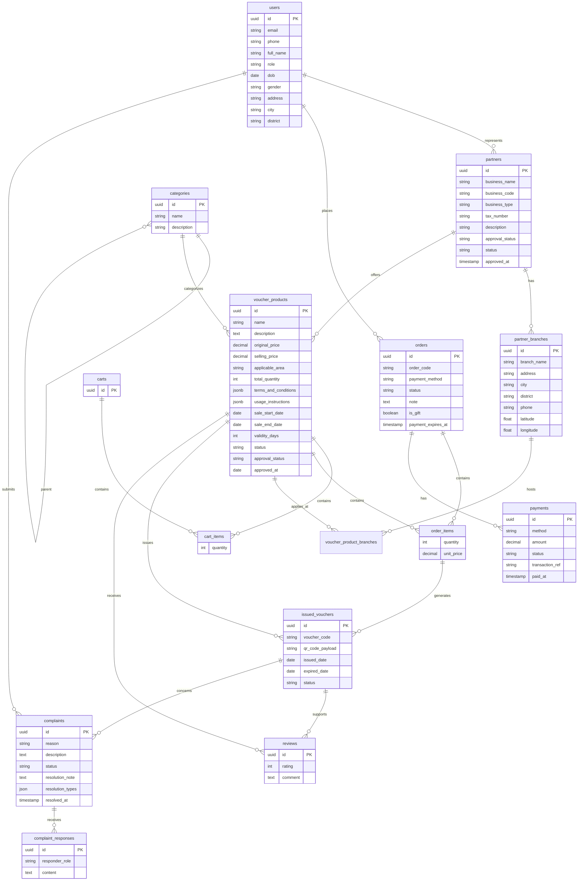
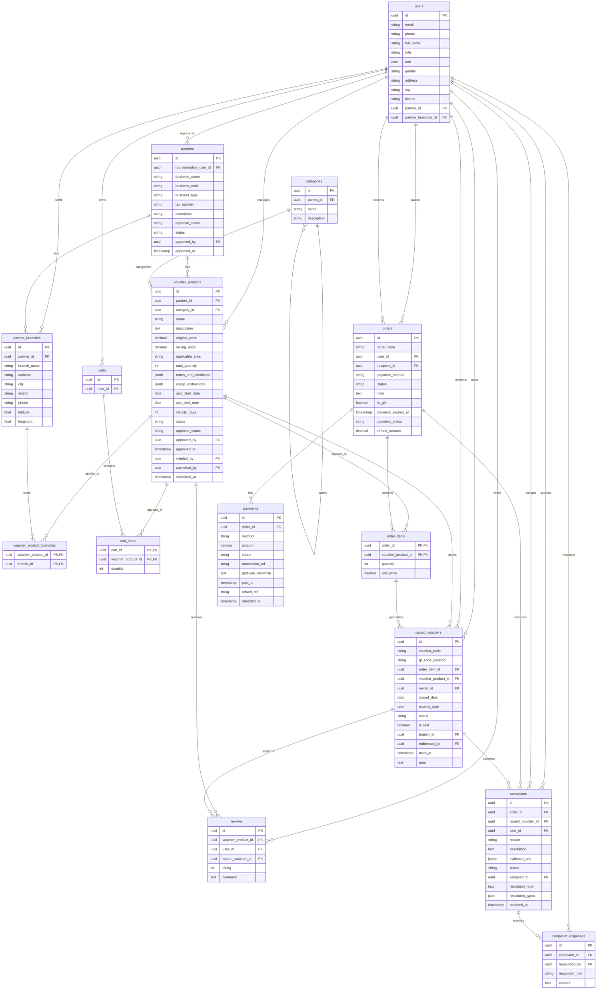

# Voucher Platform - Mô hình dữ liệu ba lớp

Nguồn đối chiếu Physical: `backend/docs/schema.md` và `backend/srcipts/db.sql`.

## Phạm vi bảng theo từng lớp

Conceptual không chứa các bảng kỹ thuật, bảng log, token, CMS hoặc metadata
thuần túy vận hành sau:

- `refresh_tokens`
- `authentication_logs`
- `admin_logs`
- `order_logs`
- `payment_logs`
- `auth_tokens`
- `security_alerts`
- `voucher_product_images`
- `cms_contents`
- `voucher_check_logs`

Physical ERD không thiếu bảng nghiệp vụ nào so với `backend/srcipts/db.sql`;
các bảng kỹ thuật được chủ động loại khỏi tài liệu Markdown. Thông tin đổi
voucher không nằm ở bảng `voucher_usages` vì
bảng này không tồn tại trong SQL, mà được lưu trực tiếp trong
`issued_vouchers`.

## 1. Conceptual ERD

> Chỉ chứa thực thể và thuộc tính nghiệp vụ. Có PK để định danh, không có FK,
> metadata kỹ thuật, thuộc tính suy diễn hoặc URL/slug. Các quan hệ N:N có
> thuộc tính dùng associative entity; `cart_items` và `order_items` không có
> `id` riêng ở lớp này.

## 2. Logical ERD

> Bổ sung PK/FK và dùng đúng tên bảng snake_case. Không chứa thuộc tính suy
> diễn (`discount_rate`, `remaining_quantity`, `snapped_*`, `subtotal`,
> `total_amount`, `discount_amount`) hoặc metadata `created_at`/`updated_at`.
> Các mốc nghiệp vụ vẫn được giữ. Associative entity dùng PK composite từ các
> FK nối quan hệ, không dùng `id` riêng.

## 3. Physical ERD

> Phản ánh đầy đủ các bảng/cột trong `schema.md`. `voucher_usages` không tồn
> tại; thông tin đổi voucher nằm trực tiếp trong `issued_vouchers`.

```mermaid
erDiagram
    users {
        uuid id PK
        varchar email
        varchar phone
        varchar password_hash
        varchar full_name
        text avatar_url
        varchar role
        date dob
        varchar gender
        text address
        varchar city
        varchar district
        boolean is_active
        boolean is_verified
        uuid partner_branches_id FK
        timestamptz created_at
        timestamptz updated_at
        integer failed_login_attempts
        timestamptz locked_until
        integer auth_version
        uuid partner_id FK
    }
    refresh_tokens {
        uuid id PK
        uuid user_id FK
        text token_hash
        timestamptz expires_at
        timestamptz revoked_at
        timestamptz created_at
    }
    authentication_logs {
        uuid id PK
        uuid user_id FK
        varchar action
        varchar status
        varchar ip_address
        text user_agent
        timestamptz occurred_at
    }
    admin_logs {
        uuid id PK
        uuid admin_id FK
        uuid target_user_id FK
        uuid target_partner_id FK
        uuid target_voucher_id FK
        varchar action
        text description
        timestamptz occurred_at
        uuid target_order_id FK
        varchar content_type
    }
    order_logs {
        uuid id PK
        uuid order_id FK
        uuid user_id FK
        varchar action
        text description
        timestamptz occurred_at
    }
    payment_logs {
        uuid id PK
        uuid payment_id FK
        uuid order_id FK
        uuid user_id FK
        varchar action
        varchar status
        numeric amount
        timestamptz occurred_at
    }
    auth_tokens {
        uuid id PK
        uuid user_id FK
        text token_hash
        varchar type
        timestamptz expires_at
        timestamptz used_at
        timestamptz created_at
    }
    security_alerts {
        uuid id PK
        uuid user_id FK
        varchar alert_type
        text detail
        varchar ip_address
        varchar status
        uuid reviewed_by FK
        timestamptz reviewed_at
        timestamptz created_at
    }
    partners {
        uuid id PK
        uuid representative_user_id FK
        varchar business_name
        varchar business_code
        varchar business_type
        varchar tax_number
        text logo_url
        text website_url
        text description
        varchar approval_status
        varchar status
        uuid approved_by FK
        timestamptz approved_at
        timestamptz created_at
        timestamptz updated_at
    }
    partner_branches {
        uuid id PK
        uuid partner_id FK
        varchar branch_name
        text address
        varchar city
        varchar district
        varchar phone
        double precision latitude
        double precision longitude
        boolean is_active
        timestamptz created_at
        varchar ward
    }
    categories {
        uuid id PK
        uuid parent_id FK
        varchar name
        varchar slug
        text description
        integer sort_order
    }
    voucher_products {
        uuid id PK
        uuid partner_id FK
        uuid category_id FK
        varchar name
        text description
        text thumbnail_url
        numeric original_price
        numeric selling_price
        float discount_rate
        varchar applicable_area
        integer total_quantity
        integer remaining_quantity
        jsonb terms_and_conditions
        jsonb usage_instructions
        date sale_start_date
        date sale_end_date
        integer validity_days
        varchar status
        varchar approval_status
        uuid approved_by FK
        timestamptz approved_at
        timestamptz created_at
        timestamptz updated_at
        uuid created_by FK
        uuid submitted_by FK
        timestamptz submitted_at
    }
    voucher_product_images {
        uuid id PK
        uuid voucher_product_id FK
        text image_url
        boolean is_primary
        integer sort_order
    }
    voucher_product_branches {
        uuid id PK
        uuid voucher_product_id FK
        uuid branch_id FK
    }
    carts {
        uuid id PK
        uuid user_id FK
        timestamptz created_at
        timestamptz updated_at
    }
    cart_items {
        uuid id PK
        uuid cart_id FK
        uuid voucher_product_id FK
        integer quantity
        timestamptz created_at
        timestamptz updated_at
    }
    orders {
        uuid id PK
        varchar order_code
        uuid user_id FK
        numeric subtotal
        numeric discount_amount
        numeric total_amount
        varchar payment_method
        varchar status
        text note
        timestamptz created_at
        timestamptz updated_at
        uuid recipient_id FK
        boolean is_gift
        timestamptz payment_expires_at
        varchar payment_status
        numeric refund_amount
    }
    order_items {
        uuid id PK
        uuid order_id FK
        uuid voucher_product_id FK
        integer quantity
        numeric unit_price
        numeric snapped_original_price
        numeric snapped_selling_price
        float snapped_discount_rate
        numeric subtotal
        timestamptz created_at
    }
    payments {
        uuid id PK
        uuid order_id FK
        varchar method
        numeric amount
        varchar status
        varchar transaction_ref
        text gateway_response
        timestamptz paid_at
        timestamptz created_at
        varchar refund_ref
        timestamptz refunded_at
    }
    issued_vouchers {
        uuid id PK
        varchar voucher_code
        varchar qr_code_payload
        text qr_code_image_url
        uuid order_item_id FK
        uuid voucher_product_id FK
        uuid owner_id FK
        date issued_date
        date expired_date
        varchar status
        timestamptz created_at
        timestamptz updated_at
        boolean is_test
        uuid branch_id FK
        uuid redeemed_by FK
        timestamptz used_at
        text note
    }
    reviews {
        uuid id PK
        uuid voucher_product_id FK
        uuid user_id FK
        uuid issued_voucher_id FK
        integer rating
        text comment
        jsonb media_urls
        boolean is_published
        timestamptz created_at
        timestamptz updated_at
    }
    complaints {
        uuid id PK
        uuid order_id FK
        uuid issued_voucher_id FK
        uuid user_id FK
        varchar reason
        text description
        jsonb evidence_urls
        varchar status
        uuid assigned_to FK
        text resolution_note
        timestamptz created_at
        timestamptz resolved_at
        json resolution_types
    }
    complaint_responses {
        uuid id PK
        uuid complaint_id FK
        uuid responded_by FK
        varchar responder_role
        text content
        timestamptz created_at
    }
    cms_contents {
        uuid id PK
        varchar content_type
        varchar title
        text content
        varchar image_url
        varchar status
        integer sort_order
        uuid created_by FK
        timestamptz created_at
        timestamptz updated_at
    }
    voucher_check_logs {
        uuid id PK
        uuid user_id FK
        varchar voucher_code
        varchar status
        text reason
        timestamptz created_at
    }
```

### Physical constraints

- PK và FK trong sơ đồ trên khớp các constraint trong `db.sql`.
- UNIQUE: `refresh_tokens.token_hash`, `partners.business_code`,
  `partners.tax_number`, `categories.slug`, `carts.user_id`,
  `orders.order_code`, `issued_vouchers.voucher_code` và
  `issued_vouchers.qr_code_payload`.
- CHECK được khai báo cho role/gender, loại đối tác, trạng thái đối tác,
  voucher, phương thức thanh toán, trạng thái payment và số lượng/validity.
- `db.sql` có các chuỗi `NOT VALI)` sau một số CHECK của orders/payments;
  đây là lỗi cú pháp của SQL nguồn, không phải bảng hoặc cột bổ sung.

## 4. Data Dictionary

Data dictionary dưới đây được trích theo cấu trúc trong
`backend/srcipts/db.sql`. Mỗi bảng sử dụng đúng bốn cột: `Column`, `Type`,
`Constraint`, `Mô tả`. `NN` = `NOT NULL`, `PK` = khóa chính, `FK` = khóa
ngoại, `UQ` = `UNIQUE`.

### `users`

| Column | Type | Constraint | Mô tả |
| ------ | ---- | ---------- | ----- |
| `id` | UUID | PK, default `gen_random_uuid()` | Định danh duy nhất |
| `email` | VARCHAR | NN | Email đăng nhập |
| `phone` | VARCHAR | nullable | Số điện thoại liên hệ |
| `password_hash` | VARCHAR | NN | Mật khẩu đã băm |
| `full_name` | VARCHAR | NN | Họ và tên |
| `avatar_url` | TEXT | nullable | URL ảnh đại diện người dùng |
| `role` | VARCHAR | NN, CHECK: `buyer`, `partner_owner`, `partner_voucher_staff`, `partner_store_staff`, `admin_content`, `admin_operations`, `admin_security` | Vai trò hệ thống |
| `dob` | DATE | nullable | Ngày sinh |
| `gender` | VARCHAR | nullable, CHECK: `male`, `female`, `other` | Giới tính |
| `address` | TEXT | nullable | Địa chỉ chi tiết |
| `city` | VARCHAR | nullable | Tỉnh hoặc thành phố |
| `district` | VARCHAR | nullable | Quận hoặc huyện |
| `is_active` | BOOLEAN | NN, default `true` | Trạng thái hoạt động |
| `is_verified` | BOOLEAN | NN, default `false` | Trạng thái xác thực |
| `partner_branches_id` | UUID | FK `partner_branches.id`, nullable | Chi nhánh làm việc |
| `created_at` | TIMESTAMPTZ | NN, default `now()` | Thời điểm tạo |
| `updated_at` | TIMESTAMPTZ | NN, default `now()` | Thời điểm cập nhật |
| `failed_login_attempts` | INTEGER | NN, default `0` | Số lần đăng nhập thất bại |
| `locked_until` | TIMESTAMPTZ | nullable | Thời điểm hết khóa |
| `auth_version` | INTEGER | NN, default `0` | Phiên bản xác thực |
| `partner_id` | UUID | FK `partners.id`, nullable | Đối tác liên quan |

### `refresh_tokens`

| Column | Type | Constraint | Mô tả |
| ------ | ---- | ---------- | ----- |
| `id` | UUID | PK, default `gen_random_uuid()` | Định danh duy nhất |
| `user_id` | UUID | FK `users.id`, NN | Người dùng liên quan |
| `token_hash` | TEXT | NN, UQ | Giá trị băm của token |
| `expires_at` | TIMESTAMPTZ | NN | Thời điểm hết hạn |
| `revoked_at` | TIMESTAMPTZ | nullable | Thời điểm token bị thu hồi |
| `created_at` | TIMESTAMPTZ | NN, default `now()` | Thời điểm tạo |

### `authentication_logs`

| Column | Type | Constraint | Mô tả |
| ------ | ---- | ---------- | ----- |
| `id` | UUID | PK, default `gen_random_uuid()` | Định danh duy nhất |
| `user_id` | UUID | FK `users.id`, nullable | Người dùng liên quan |
| `action` | VARCHAR | NN | Hành động |
| `status` | VARCHAR | NN | Trạng thái |
| `ip_address` | VARCHAR | nullable | Địa chỉ IP |
| `user_agent` | TEXT | nullable | Thông tin trình duyệt hoặc thiết bị |
| `occurred_at` | TIMESTAMPTZ | NN, default `now()` | Thời điểm phát sinh sự kiện |

### `admin_logs`

| Column | Type | Constraint | Mô tả |
| ------ | ---- | ---------- | ----- |
| `id` | UUID | PK, default `gen_random_uuid()` | Định danh duy nhất |
| `admin_id` | UUID | FK `users.id`, NN | Quản trị viên thực hiện |
| `target_user_id` | UUID | FK `users.id`, nullable | Người dùng bị tác động |
| `target_partner_id` | UUID | FK `partners.id`, nullable | Đối tác bị tác động |
| `target_voucher_id` | UUID | FK `voucher_products.id`, nullable | Voucher bị tác động |
| `action` | VARCHAR | NN | Hành động |
| `description` | TEXT | nullable | Mô tả chi tiết |
| `occurred_at` | TIMESTAMPTZ | NN, default `now()` | Thời điểm phát sinh sự kiện |
| `target_order_id` | UUID | FK `orders.id`, nullable | Đơn hàng bị tác động |
| `content_type` | VARCHAR | nullable | Loại nội dung |

### `partners`

| Column | Type | Constraint | Mô tả |
| ------ | ---- | ---------- | ----- |
| `id` | UUID | PK, default `gen_random_uuid()` | Định danh duy nhất |
| `representative_user_id` | UUID | FK `users.id`, NN | Người đại diện đối tác |
| `business_name` | VARCHAR | NN | Tên doanh nghiệp |
| `business_code` | VARCHAR | NN, UQ | Mã doanh nghiệp |
| `business_type` | VARCHAR | nullable, CHECK: `restaurant`, `spa`, `entertainment`, `hotel`, `other` | Loại hình kinh doanh |
| `tax_number` | VARCHAR | nullable, UQ | Mã số thuế |
| `logo_url` | TEXT | nullable | URL logo đối tác |
| `website_url` | TEXT | nullable | URL website đối tác |
| `description` | TEXT | nullable | Mô tả chi tiết |
| `approval_status` | VARCHAR | NN, default `pending`, CHECK: `pending`, `approved`, `rejected` | Thông tin nghiệp vụ của approval_status |
| `status` | VARCHAR | NN, default `active`, CHECK: `active`, `suspended`, `closed` | Trạng thái |
| `approved_by` | UUID | FK `users.id`, nullable | Người phê duyệt |
| `approved_at` | TIMESTAMPTZ | nullable | Thời điểm phê duyệt |
| `created_at` | TIMESTAMPTZ | NN, default `now()` | Thời điểm tạo |
| `updated_at` | TIMESTAMPTZ | NN, default `now()` | Thời điểm cập nhật |

### `partner_branches`

| Column | Type | Constraint | Mô tả |
| ------ | ---- | ---------- | ----- |
| `id` | UUID | PK, default `gen_random_uuid()` | Định danh duy nhất |
| `partner_id` | UUID | FK `partners.id`, NN | Đối tác liên quan |
| `branch_name` | VARCHAR | NN | Tên chi nhánh |
| `address` | TEXT | NN | Địa chỉ chi tiết |
| `city` | VARCHAR | NN | Tỉnh hoặc thành phố |
| `district` | VARCHAR | nullable | Quận hoặc huyện |
| `phone` | VARCHAR | nullable | Số điện thoại liên hệ |
| `latitude` | DOUBLE PRECISION | nullable | Vĩ độ của chi nhánh |
| `longitude` | DOUBLE PRECISION | nullable | Kinh độ của chi nhánh |
| `is_active` | BOOLEAN | NN, default `true` | Trạng thái hoạt động |
| `created_at` | TIMESTAMPTZ | NN, default `now()` | Thời điểm tạo |
| `ward` | VARCHAR | nullable | Phường hoặc xã |

### `categories`

| Column | Type | Constraint | Mô tả |
| ------ | ---- | ---------- | ----- |
| `id` | UUID | PK, default `gen_random_uuid()` | Định danh duy nhất |
| `parent_id` | UUID | FK `categories.id`, nullable | Danh mục cha |
| `name` | VARCHAR | NN | Tên đối tượng |
| `slug` | VARCHAR | NN, UQ | Định danh dùng cho URL |
| `description` | TEXT | nullable | Mô tả chi tiết |
| `sort_order` | INTEGER | NN, default `0` | Thứ tự hiển thị |

### `voucher_products`

| Column | Type | Constraint | Mô tả |
| ------ | ---- | ---------- | ----- |
| `id` | UUID | PK, default `gen_random_uuid()` | Định danh duy nhất |
| `partner_id` | UUID | FK `partners.id`, NN | Đối tác liên quan |
| `category_id` | UUID | FK `categories.id`, NN | Danh mục liên quan |
| `name` | VARCHAR | NN | Tên đối tượng |
| `description` | TEXT | nullable | Mô tả chi tiết |
| `thumbnail_url` | TEXT | nullable | URL ảnh đại diện |
| `original_price` | NUMERIC | NN | Giá gốc |
| `selling_price` | NUMERIC | NN | Giá bán |
| `discount_rate` | DOUBLE PRECISION | NN, default `0` | Tỷ lệ giảm giá |
| `applicable_area` | VARCHAR | nullable | Khu vực áp dụng |
| `total_quantity` | INTEGER | NN, CHECK `>= 0` | Tổng số lượng voucher |
| `remaining_quantity` | INTEGER | NN, CHECK `>= 0` | Số lượng voucher còn lại |
| `terms_and_conditions` | JSONB | nullable | Điều kiện và điều khoản sử dụng |
| `usage_instructions` | JSONB | nullable | Hướng dẫn sử dụng |
| `sale_start_date` | DATE | NN | Ngày bắt đầu mở bán |
| `sale_end_date` | DATE | NN | Ngày kết thúc mở bán |
| `validity_days` | INTEGER | NN, CHECK `> 0` | Số ngày có hiệu lực |
| `status` | VARCHAR | NN, default `draft`, CHECK: `draft`, `active`, `paused`, `sold_out`, `expired` | Trạng thái |
| `approval_status` | VARCHAR | NN, default `pending`, CHECK: `pending`, `approved`, `rejected` | Thông tin nghiệp vụ của approval_status |
| `approved_by` | UUID | FK `users.id`, nullable | Người phê duyệt |
| `approved_at` | TIMESTAMPTZ | nullable | Thời điểm phê duyệt |
| `created_at` | TIMESTAMPTZ | NN, default `now()` | Thời điểm tạo |
| `updated_at` | TIMESTAMPTZ | NN, default `now()` | Thời điểm cập nhật |
| `created_by` | UUID | FK `users.id`, nullable | Người tạo |
| `submitted_by` | UUID | FK `users.id`, nullable | Người gửi phê duyệt |
| `submitted_at` | TIMESTAMPTZ | nullable | Thời điểm gửi phê duyệt |

### `voucher_product_images`

| Column | Type | Constraint | Mô tả |
| ------ | ---- | ---------- | ----- |
| `id` | UUID | PK, default `gen_random_uuid()` | Định danh duy nhất |
| `voucher_product_id` | UUID | FK `voucher_products.id`, NN | Voucher sản phẩm liên quan |
| `image_url` | TEXT | NN | URL hình ảnh |
| `is_primary` | BOOLEAN | NN, default `false` | Cho biết đây là hình ảnh chính |
| `sort_order` | INTEGER | NN, default `0` | Thứ tự hiển thị |

### `voucher_product_branches`

| Column | Type | Constraint | Mô tả |
| ------ | ---- | ---------- | ----- |
| `id` | UUID | PK, default `gen_random_uuid()` | Định danh duy nhất |
| `voucher_product_id` | UUID | FK `voucher_products.id`, NN | Voucher sản phẩm liên quan |
| `branch_id` | UUID | FK `partner_branches.id`, NN | Chi nhánh liên quan |

### `carts` và `cart_items`

| Column | Type | Constraint | Mô tả |
| ------ | ---- | ---------- | ----- |
| `carts.id` | UUID | PK, default `gen_random_uuid()` | Định danh duy nhất |
| `carts.user_id` | UUID | FK `users.id`, NN, UQ | Người dùng liên quan |
| `carts.created_at` | TIMESTAMPTZ | NN, default `now()` | Thời điểm tạo |
| `carts.updated_at` | TIMESTAMPTZ | NN, default `now()` | Thời điểm cập nhật |
| `cart_items.id` | UUID | PK, default `gen_random_uuid()` | Định danh duy nhất |
| `cart_items.cart_id` | UUID | FK `carts.id`, NN | Giỏ hàng liên quan |
| `cart_items.voucher_product_id` | UUID | FK `voucher_products.id`, NN | Voucher sản phẩm liên quan |
| `cart_items.quantity` | INTEGER | NN, CHECK `> 0` | Số lượng |
| `cart_items.created_at` | TIMESTAMPTZ | NN, default `now()` | Thời điểm tạo |
| `cart_items.updated_at` | TIMESTAMPTZ | NN, default `now()` | Thời điểm cập nhật |

### `orders`

| Column | Type | Constraint | Mô tả |
| ------ | ---- | ---------- | ----- |
| `id` | UUID | PK, default `gen_random_uuid()` | Định danh duy nhất |
| `order_code` | VARCHAR | NN, UQ | Mã đơn hàng |
| `user_id` | UUID | FK `users.id`, NN | Người dùng liên quan |
| `subtotal` | NUMERIC | NN | Tạm tính |
| `discount_amount` | NUMERIC | NN, default `0` | Số tiền giảm |
| `total_amount` | NUMERIC | NN | Tổng số tiền |
| `payment_method` | VARCHAR | NN, CHECK: `vnpay`, `paypal` | Phương thức thanh toán |
| `status` | VARCHAR | NN, default `pending` | Trạng thái |
| `note` | TEXT | nullable | Ghi chú |
| `created_at` | TIMESTAMPTZ | NN, default `now()` | Thời điểm tạo |
| `updated_at` | TIMESTAMPTZ | NN, default `now()` | Thời điểm cập nhật |
| `recipient_id` | UUID | FK `users.id`, NN | Người nhận voucher |
| `is_gift` | BOOLEAN | NN, default `false` | Đơn hàng quà tặng |
| `payment_expires_at` | TIMESTAMPTZ | nullable | Thời hạn thanh toán |
| `payment_status` | VARCHAR | NN, default `pending` | Trạng thái thanh toán |
| `refund_amount` | NUMERIC | NN, default `0` | Số tiền hoàn trả |

### `order_items`

| Column | Type | Constraint | Mô tả |
| ------ | ---- | ---------- | ----- |
| `id` | UUID | PK, default `gen_random_uuid()` | Định danh duy nhất |
| `order_id` | UUID | FK `orders.id`, NN | Đơn hàng liên quan |
| `voucher_product_id` | UUID | FK `voucher_products.id`, NN | Voucher sản phẩm liên quan |
| `quantity` | INTEGER | NN, CHECK `> 0` | Số lượng |
| `unit_price` | NUMERIC | NN | Đơn giá |
| `snapped_original_price` | NUMERIC | NN | Giá gốc tại thời điểm mua |
| `snapped_selling_price` | NUMERIC | NN | Giá bán tại thời điểm mua |
| `snapped_discount_rate` | DOUBLE PRECISION | NN | Tỷ lệ giảm giá tại thời điểm mua |
| `subtotal` | NUMERIC | NN | Tạm tính |
| `created_at` | TIMESTAMPTZ | NN, default `now()` | Thời điểm tạo |

### `payments`

| Column | Type | Constraint | Mô tả |
| ------ | ---- | ---------- | ----- |
| `id` | UUID | PK, default `gen_random_uuid()` | Định danh duy nhất |
| `order_id` | UUID | FK `orders.id`, NN | Đơn hàng liên quan |
| `method` | VARCHAR | NN, CHECK: `vnpay`, `paypal` | Phương thức |
| `amount` | NUMERIC | NN | Số tiền |
| `status` | VARCHAR | NN, default `pending`, CHECK: `pending`, `processing`, `success`, `failed`, `refunded` | Trạng thái |
| `transaction_ref` | VARCHAR | nullable | Mã giao dịch |
| `gateway_response` | TEXT | nullable | Phản hồi từ cổng thanh toán |
| `paid_at` | TIMESTAMPTZ | nullable | Thời điểm thanh toán |
| `created_at` | TIMESTAMPTZ | NN, default `now()` | Thời điểm tạo |
| `refund_ref` | VARCHAR | nullable | Mã tham chiếu hoàn tiền |
| `refunded_at` | TIMESTAMPTZ | nullable | Thời điểm hoàn tiền |

### `order_logs` và `payment_logs`

| Column | Type | Constraint | Mô tả |
| ------ | ---- | ---------- | ----- |
| `order_logs.id` | UUID | PK, default `gen_random_uuid()` | Định danh duy nhất |
| `order_logs.order_id` | UUID | FK `orders.id`, NN | Đơn hàng liên quan |
| `order_logs.user_id` | UUID | FK `users.id`, NN | Người dùng liên quan |
| `order_logs.action` | VARCHAR | NN | Hành động |
| `order_logs.description` | TEXT | nullable | Mô tả chi tiết |
| `order_logs.occurred_at` | TIMESTAMPTZ | NN, default `now()` | Thời điểm phát sinh sự kiện |
| `payment_logs.id` | UUID | PK, default `gen_random_uuid()` | Định danh duy nhất |
| `payment_logs.payment_id` | UUID | FK `payments.id`, NN | Thanh toán liên quan |
| `payment_logs.order_id` | UUID | FK `orders.id`, NN | Đơn hàng liên quan |
| `payment_logs.user_id` | UUID | FK `users.id`, NN | Người dùng liên quan |
| `payment_logs.action` | VARCHAR | NN | Hành động |
| `payment_logs.status` | VARCHAR | NN | Trạng thái |
| `payment_logs.amount` | NUMERIC | NN | Số tiền |
| `payment_logs.occurred_at` | TIMESTAMPTZ | NN, default `now()` | Thời điểm phát sinh sự kiện |

### `issued_vouchers`

| Column | Type | Constraint | Mô tả |
| ------ | ---- | ---------- | ----- |
| `id` | UUID | PK, default `gen_random_uuid()` | Định danh duy nhất |
| `voucher_code` | VARCHAR | NN, UQ | Mã voucher |
| `qr_code_payload` | VARCHAR | NN, UQ | Dữ liệu mã QR |
| `qr_code_image_url` | TEXT | nullable | URL ảnh mã QR |
| `order_item_id` | UUID | FK `order_items.id`, nullable | Dòng hàng liên quan |
| `voucher_product_id` | UUID | FK `voucher_products.id`, NN | Voucher sản phẩm liên quan |
| `owner_id` | UUID | FK `users.id`, nullable | Chủ sở hữu voucher |
| `issued_date` | DATE | NN, default `CURRENT_DATE` | Ngày phát hành |
| `expired_date` | DATE | NN | Ngày hết hạn |
| `status` | VARCHAR | NN, default `active`, CHECK: `active`, `used`, `expired`, `revoked`, `cancelled` | Trạng thái |
| `created_at` | TIMESTAMPTZ | NN, default `now()` | Thời điểm tạo |
| `updated_at` | TIMESTAMPTZ | NN, default `now()` | Thời điểm cập nhật |
| `is_test` | BOOLEAN | NN, default `false` | Dữ liệu thử nghiệm |
| `branch_id` | UUID | FK `partner_branches.id`, nullable | Chi nhánh liên quan |
| `redeemed_by` | UUID | FK `users.id`, nullable | Người xác nhận đổi voucher |
| `used_at` | TIMESTAMPTZ | nullable | Thời điểm sử dụng |
| `note` | TEXT | nullable | Ghi chú |

### `reviews`

| Column | Type | Constraint | Mô tả |
| ------ | ---- | ---------- | ----- |
| `reviews.id` | UUID | PK, default `gen_random_uuid()` | Định danh duy nhất |
| `reviews.voucher_product_id` | UUID | FK `voucher_products.id`, NN | Voucher sản phẩm liên quan |
| `reviews.user_id` | UUID | FK `users.id`, NN | Người dùng liên quan |
| `reviews.issued_voucher_id` | UUID | FK `issued_vouchers.id`, NN | Voucher đã phát hành liên quan |
| `reviews.rating` | INTEGER | NN | Điểm đánh giá |
| `reviews.comment` | TEXT | nullable | Nội dung nhận xét |
| `reviews.media_urls` | JSONB | nullable | Danh sách URL tệp đính kèm |
| `reviews.is_published` | BOOLEAN | NN, default `true` | Trạng thái hiển thị |
| `reviews.created_at` | TIMESTAMPTZ | NN, default `CURRENT_TIMESTAMP` | Thời điểm tạo |
| `reviews.updated_at` | TIMESTAMPTZ | NN, default `CURRENT_TIMESTAMP` | Thời điểm cập nhật |
### `complaints` và `complaint_responses`

| Column | Type | Constraint | Mô tả |
| ------ | ---- | ---------- | ----- |
| `complaints.id` | UUID | PK, default `gen_random_uuid()` | Định danh duy nhất |
| `complaints.order_id` | UUID | FK `orders.id`, nullable | Đơn hàng liên quan |
| `complaints.issued_voucher_id` | UUID | FK `issued_vouchers.id`, nullable | Voucher đã phát hành liên quan |
| `complaints.user_id` | UUID | FK `users.id`, NN | Người dùng liên quan |
| `complaints.reason` | VARCHAR | NN | Lý do |
| `complaints.description` | TEXT | NN | Mô tả chi tiết |
| `complaints.evidence_urls` | JSONB | nullable | Danh sách URL bằng chứng |
| `complaints.status` | VARCHAR | NN, default `open` | Trạng thái |
| `complaints.assigned_to` | UUID | FK `users.id`, nullable | Người được phân công |
| `complaints.resolution_note` | TEXT | nullable | Ghi chú xử lý |
| `complaints.created_at` | TIMESTAMPTZ | NN, default `CURRENT_TIMESTAMP` | Thời điểm tạo |
| `complaints.resolved_at` | TIMESTAMPTZ | nullable | Thời điểm giải quyết |
| `complaints.resolution_types` | JSON | nullable | Các hình thức xử lý |
| `complaint_responses.id` | UUID | PK, default `gen_random_uuid()` | Định danh duy nhất |
| `complaint_responses.complaint_id` | UUID | FK `complaints.id`, NN | Khiếu nại liên quan |
| `complaint_responses.responded_by` | UUID | FK `users.id`, NN | User gửi phản hồi |
| `complaint_responses.responder_role` | VARCHAR | NN | Vai trò người phản hồi |
| `complaint_responses.content` | TEXT | NN | Nội dung |
| `complaint_responses.created_at` | TIMESTAMPTZ | NN, default `CURRENT_TIMESTAMP` | Thời điểm tạo |

### `auth_tokens`

| Column | Type | Constraint | Mô tả |
| ------ | ---- | ---------- | ----- |
| `id` | UUID | PK, default `gen_random_uuid()` | Định danh duy nhất |
| `user_id` | UUID | FK `users.id`, NN | Người dùng liên quan |
| `token_hash` | TEXT | NN | Giá trị băm của token |
| `type` | VARCHAR | NN | Loại |
| `expires_at` | TIMESTAMPTZ | NN | Thời điểm hết hạn |
| `used_at` | TIMESTAMPTZ | nullable | Thời điểm sử dụng |
| `created_at` | TIMESTAMPTZ | NN, default `CURRENT_TIMESTAMP` | Thời điểm tạo |

### `security_alerts`

| Column | Type | Constraint | Mô tả |
| ------ | ---- | ---------- | ----- |
| `id` | UUID | PK, default `gen_random_uuid()` | Định danh duy nhất |
| `user_id` | UUID | FK `users.id`, NN | Người dùng liên quan |
| `alert_type` | VARCHAR | NN | Loại cảnh báo |
| `detail` | TEXT | nullable | Chi tiết cảnh báo |
| `ip_address` | VARCHAR | nullable | Địa chỉ IP |
| `status` | VARCHAR | NN, default `open` | Trạng thái |
| `reviewed_by` | UUID | FK `users.id`, nullable | Người xem xét cảnh báo |
| `reviewed_at` | TIMESTAMPTZ | nullable | Thời điểm xem xét cảnh báo |
| `created_at` | TIMESTAMPTZ | NN, default `CURRENT_TIMESTAMP` | Thời điểm tạo |

### `cms_contents`

| Column | Type | Constraint | Mô tả |
| ------ | ---- | ---------- | ----- |
| `id` | UUID | PK, default `gen_random_uuid()` | Định danh duy nhất |
| `content_type` | VARCHAR | NN | Loại nội dung |
| `title` | VARCHAR | NN | Tiêu đề nội dung |
| `content` | TEXT | nullable | Nội dung |
| `image_url` | VARCHAR | nullable | URL hình ảnh |
| `status` | VARCHAR | NN, default `active` | Trạng thái |
| `sort_order` | INTEGER | NN, default `0` | Thứ tự hiển thị |
| `created_by` | UUID | FK `users.id`, nullable | Người tạo |
| `created_at` | TIMESTAMPTZ | NN, default `CURRENT_TIMESTAMP` | Thời điểm tạo |
| `updated_at` | TIMESTAMPTZ | NN, default `CURRENT_TIMESTAMP` | Thời điểm cập nhật |

### `voucher_check_logs`

| Column | Type | Constraint | Mô tả |
| ------ | ---- | ---------- | ----- |
| `id` | UUID | PK, default `gen_random_uuid()` | Định danh duy nhất |
| `user_id` | UUID | FK `users.id`, NN | Người dùng liên quan |
| `voucher_code` | VARCHAR | nullable | Mã voucher |
| `status` | VARCHAR | NN | Trạng thái |
| `reason` | TEXT | nullable | Lý do |
| `created_at` | TIMESTAMPTZ | NN, default `CURRENT_TIMESTAMP` | Thời điểm tạo |

## 5. Enum và domain values trong code

Các cột trong database vẫn được khai báo là `VARCHAR`; các tập giá trị dưới
đây được giới hạn/kiểm tra ở validation và service của backend.

| Table | Attribute | Allowed values |
| ----- | --------- | -------------- |
| `users` | `role` | `buyer`, `partner_owner`, `partner_voucher_staff`, `partner_store_staff`, `admin_content`, `admin_operations`, `admin_security` | Vai trò và quyền hạn của người dùng |
| `users` | `gender` | `male`, `female`, `other` | Giới tính người dùng |
| `partners` | `business_type` | `restaurant`, `spa`, `entertainment`, `hotel`, `other` | Loại hình kinh doanh |
| `partners` | `approval_status` | `pending`, `approved`, `rejected` | Trạng thái phê duyệt đối tác |
| `partners` | `status` | `active`, `suspended`, `closed` | Trạng thái hoạt động đối tác |
| `voucher_products` | `approval_status` | `pending`, `approved`, `rejected` | Trạng thái phê duyệt voucher |
| `voucher_products` | `status` | `draft`, `active`, `paused`, `sold_out`, `expired` | Trạng thái bán voucher |
| `orders` | `payment_method` | `vnpay`, `paypal` | Cổng thanh toán của đơn hàng |
| `orders` | `status` | `pending_payment`, `payment_failed`, `confirmed`, `cancelled`, `refunded` | Trạng thái đơn hàng |
| `orders` | `payment_status` | `pending`, `paid`, `failed`, `refunded` | Trạng thái thanh toán đơn hàng |
| `payments` | `method` | `vnpay`, `paypal` | Cổng thanh toán sử dụng |
| `payments` | `status` | `pending`, `processing`, `success`, `failed`, `refunded` | Trạng thái giao dịch |
| `issued_vouchers` | `status` | `active`, `used`, `expired`, `revoked`, `cancelled` | Trạng thái voucher phát hành |
| `complaints` | `reason` | `not_as_described`, `cannot_redeem`, `expired_early`, `wrong_value`, `other` | Lý do khiếu nại |
| `complaints` | `status` | `open`, `contacting_partner`, `reissued`, `refunded` | Trạng thái xử lý khiếu nại |
| `complaints` | `resolution_types[]` | `refund`, `reissue`, `no_action` | Các hình thức xử lý khiếu nại |
| `complaint_responses` | `responder_role` | `admin`, `partner`, `user` | Vai trò người phản hồi |
| `auth_tokens` | `type` | `EMAIL_VERIFICATION`, `PASSWORD_RESET` | Mục đích của token xác thực |
| `security_alerts` | `alert_type` | `brute_force`, `unusual_ip`, `multiple_device`, `suspicious_time` | Loại cảnh báo bảo mật |
| `security_alerts` | `status` | `open`, `reviewed`, `locked` | Trạng thái xử lý cảnh báo |
| `cms_contents` | `content_type` | `banner`, `article`, `popup`, `policy` | Loại nội dung CMS |
| `cms_contents` | `status` | `active`, `hidden` | Trạng thái hiển thị nội dung |
| `admin_logs` | `action` | `user_created`, `user_updated`, `user_deactivated`, `user_activated`, `partner_created`, `partner_updated`, `partner_approved`, `partner_rejected`, `partner_status_changed`, `branch_created`, `branch_updated`, `branch_deleted`, `voucher_created`, `voucher_updated`, `voucher_submitted`, `voucher_approved`, `voucher_rejected`, `voucher_status_changed`, `complaint_assigned`, `complaint_resolved`, `complaint_closed`, `role_assigned`, `role_revoked`, `security_lock_account`, `security_unlock_account`, `security_review_alert`, `admin_action` | Hành động quản trị được ghi nhận |

`authentication_logs.action` hiện được sử dụng với `LOGIN`, `LOGIN_FAILED`,
`VERIFY_EMAIL`, `RESET_PASSWORD`, `LOGOUT` và `CHANGE_PASSWORD`. Giá trị
`authentication_logs.status` được service ghi nhận gồm `success`, `failed`,
`locked`, `account_not_found`, `unverified`, `rejected`, `pending`,
`partner_inactive`, `blocked`.
